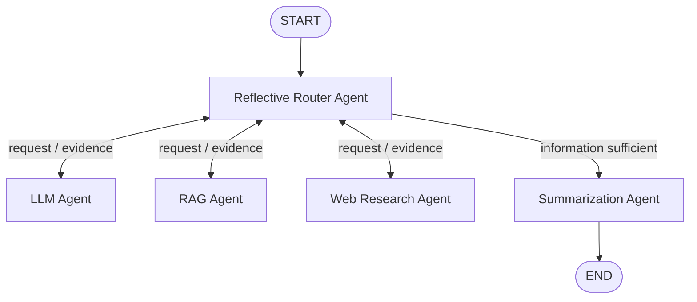
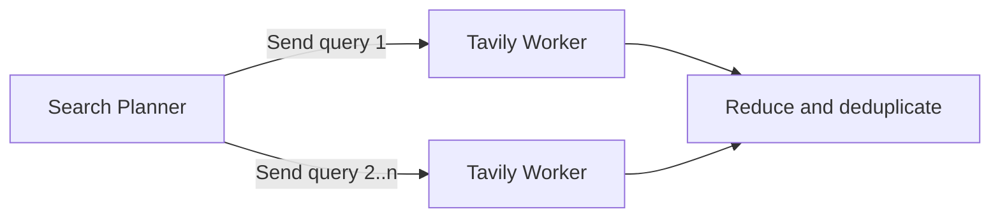

# Multi-Agent Research and Summarization

This project routes a question to a general OpenAI model, live Tavily research, or
a Chroma RAG index of *Attention Is All You Need*. Each specialist returns its
evidence to the reflective router. Only after the router confirms that the evidence
is sufficient does it send the state to the summarization agent. SQLite checkpoints
preserve conversation state by thread.

## Architecture



The router sends work to a specialist using `Command(goto=...)`. Each specialist
returns its evidence to the router through a graph edge. The router may repeat this
reflection cycle with another agent. Once the available information is sufficient,
the router dynamically selects the summarization agent, which produces the final
answer and ends the graph.

### Web Research Agent internals



- `router_agent.py` is a reflection agent. It examines accumulated evidence after
  every specialist call, identifies missing information, and returns LangGraph
  `Command` to either call another specialist or approve final summarization. A
  configurable reflection limit prevents unbounded loops.
- `web_research_agent.py` plans one to three searches and fans them out with
  `Send`; a reducer deduplicates and ranks the collected Tavily results.
- `rag_agent.py` lazily chunks and embeds the supplied PDF. Its fingerprinted
  Chroma collection is reused on later runs.
- `summarization_agent.py` turns the selected agent's evidence into a sourced
  Markdown answer.
- `main.py` composes the nodes and uses `SqliteSaver` for persistent, thread-level
  system memory.

Each of the four agent files also has its own `main()` entry point and can run by
itself.

## Setup and run

From the repository root:

```bash
source .venv/bin/activate
cp 13_building_advanced_ai_agent_with_langgraph/assignment/.env.example \
  13_building_advanced_ai_agent_with_langgraph/assignment/.env
# Fill OPENAI_API_KEY and TAVILY_API_KEY in assignment/.env

python 13_building_advanced_ai_agent_with_langgraph/assignment/main.py \
  "Explain multi-head attention from the Transformer paper" \
  --thread-id demo-user
```

Keep only secrets in `.env`. Non-secret runtime settings such as model names,
Tavily search depth, RAG chunking, and the reflection limit are configured in
`config.yaml`.

Execution tracing is enabled by default with `execution.verbose: true`. It displays
the agent/node being executed, routing decisions, reflection steps, search fan-out,
evidence counts, and the final transition to `END`. It deliberately avoids printing
full prompts, evidence, or secrets. Override it for a run with `--verbose` or
`--no-verbose`:

```bash
python 13_building_advanced_ai_agent_with_langgraph/assignment/main.py \
  "Explain multi-head attention" --verbose
```

Interactive mode keeps the same memory thread:

```bash
python 13_building_advanced_ai_agent_with_langgraph/assignment/main.py \
  --interactive --thread-id demo-user
```

Standalone examples:

```bash
python 13_building_advanced_ai_agent_with_langgraph/assignment/router_agent.py \
  "What is the latest OpenAI model?"
python 13_building_advanced_ai_agent_with_langgraph/assignment/web_research_agent.py \
  "What are today's major AI announcements?"
python 13_building_advanced_ai_agent_with_langgraph/assignment/rag_agent.py \
  "Why does the Transformer use positional encoding?"
python 13_building_advanced_ai_agent_with_langgraph/assignment/summarization_agent.py \
  "What happened?" "The supplied research notes go here."
```

## Example initial-routing tests

| Query | Expected first route | Reason |
|---|---|---|
| `What is the latest stable Python release?` | `web` | Time-sensitive fact |
| `How does scaled dot-product attention work?` | `rag` | Covered by the supplied paper |
| `Explain recursion with an analogy.` | `llm` | Stable general explanation |

The first RAG request creates `chroma_db/` and incurs embedding usage. Later runs
reuse the persistent collection. Web requests consume Tavily quota, with at most
three searches per question by default.
